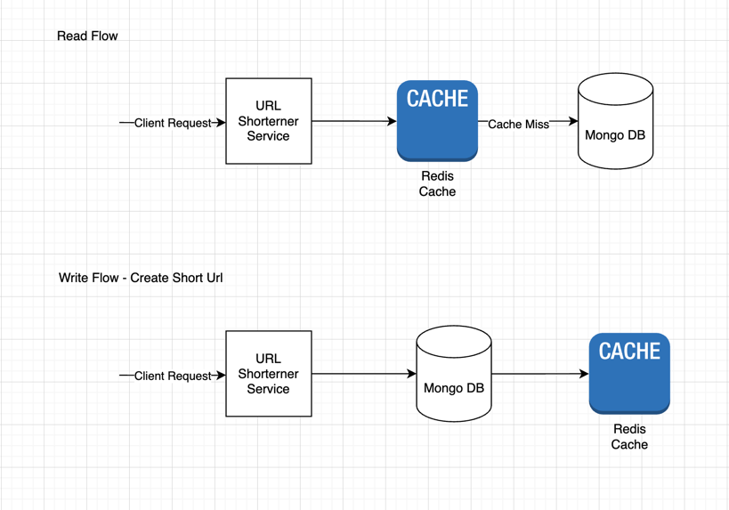

# URL Shortener Service

A high-performance, reactive URL shortener built using Java 17, Spring WebFlux, Redis, and MongoDB.
Designed with modular architecture, cache persistence considerations, and production-grade practices.

## Features

- Reactive non-blocking architecture using Spring WebFlux
- Cache-first strategy with fallback to persistent MongoDB
- Distributed-safe short code generation using Redis atomic counters
- Metrics and logging integrated for observability
- Docker-ready configuration

## Design Considerations and Trade-offs

- Redis is used as the caching layer with Base62 encoded short URLs.
- Redis' atomic counter generates unique short URL keys.
    - ⚠️ Without AOF (Append Only File) persistence, Redis restarts can reset the counter.
    - ✅ Use `appendonly yes` in production to prevent counter loss.
    - ⛔ RDB snapshots alone are not reliable for preserving state between crashes.
- NOT IMPLEMENTED: Client side caching, for more frequent requests, we can use client side caching to reduce the load on the server.

## Tech Stack

- Java 17+
- Redis 8.0.2+
- Maven 3.9.9+
- MongoDB 8.0.4+

## Getting Started

1. **Clone the repository:**
   ```bash
   git clone https://github.com/CodeOptimusPrime46/url-shortener-service.git cd url-shortener-service
   cd url-shortener-microservice
   ```

2. **Configure Redis:**
    - Ensure Redis is running locally on default port `6379` or update `application.yml` accordingly.

3. **Configure MongoDB:**
    - Ensure MongoDB is running locally or update `application.yml` with your MongoDB connection details.
    - Create a database named `urlshortener` or update the `application.yml` with your preferred database name.

4. **Build and run the application:**

  ```bash
  mvn clean install
  ```

5. **Run the application:**

   ```bash
   mvn spring-boot:run
   ```
   or

  ```bash
   java -jar url-shortener-microservice/target/url-shortener-microservice-0.0.1-SNAPSHOT.jar
   ```

6. **API Usage:**

    - ***Shorten a URL***
      ```
      POST /v1/shorten
      {
        "url": "https://example.com"
      }
      ```
      ***Response:***
      ```
      {
        "shortUrl": "2EA"
      }
      ```

    - **Redirect**
      ```
      GET /v1/{shortUrl}
      ```
      Redirects to the original URL.

    - **Retrieve Long Url**
      ```
      GET /v1/get/{shortUrl}
      ```
      Get the original URL.

## Flow



## License

This project is licensed under the MIT License.

